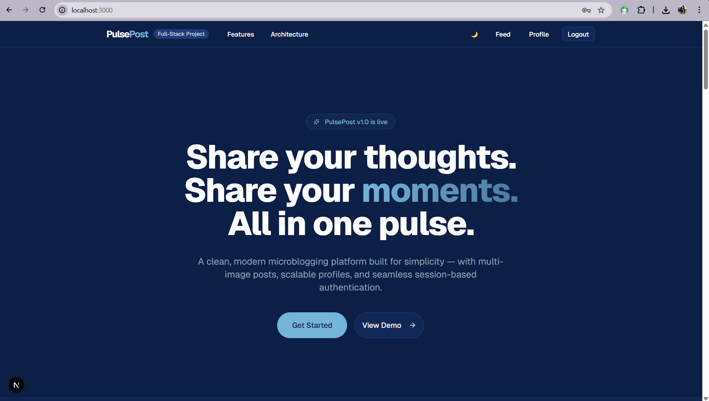

[]()
[]()
[]()
[]()
[]()
[]()
[]()

# PulsePost: A Full-Stack Microblogging Platform

PulsePost is a modern, decoupled microblogging platform designed to demonstrate scalable full-stack engineering using Next.js and Django. It implements a robust RESTful backend utilizing Django REST Framework alongside a highly responsive React frontend. Critical infrastructure focuses include session-based authentication with strict CSRF boundaries, multi-image relational data modeling, and performance-aware query optimization.

## 🚀 Key Features

* **Multi-Image Tweet Support**: Relational data modeling using a dedicated `TweetImage` schema mapping back to parent posts.
* **Owner-Based Permissions**: Custom DRF object-level policies enforcing strict edit and deletion rules.
* **Automated Profile System**: Django signals handle automatic user profile creation upon registration.
* **Secure Authentication**: Traditional session-based authentication layered with explicitly handled cross-origin CSRF protection.
* **Optimized Database Queries**: Strategic use of `select_related` and `prefetch_related` to prevent N+1 polling.
* **Bulk Processing**: Efficient multi-image insertion relying on Django's `bulk_create` manager.
* **Modular API Architecture**: Clean separation of concerns routing logic cleanly through isolated Django apps.
* **Responsive UI Design**: Dynamic, adaptive frontend image grid rendering via Next.js and Tailwind CSS.

## 🏗 Architecture Overview

PulsePost is built utilizing a decoupled architecture approach rather than a traditional monolithic application layout. Designed with performance and relational integrity in mind rather than simple single-table modeling.

**Backend (Django + DRF)**
The backend serves strictly as an API layer, segmented into modular apps housing specific domain logic. Endpoints are strictly RESTful, interacting with custom permission classes to ensure resource security. Query optimizations are heavily enforced across aggregate data fetches to ensure serialization speed without degradation.

**Frontend (Next.js App Router)**
The frontend operates independently, consuming the API through a customized fetch abstraction layer that explicitly includes `credentials: "include"` for secure session transmission. It implements intelligent CSRF configuration and renders complex relational payloads into an adaptive CSS image grid UI.

## 🔐 Authentication Strategy

This project bypasses common JWT token abstractions in favor of classic **Session-Based Authentication**. Operating across decoupled ports necessitates complex, secure cross-origin cookie handling. 

The API mandates a strict CSRF token handshake before processing any mutating operations. Object-level logic verifies request ownership (`is_owner`) at the backend view layer before allowing any update or deletion actions.

## 🗄 Database Modeling Highlights

Rather than relying on flat, single-table schemas, PulsePost focuses on structural relational integrity. 

A One-to-Many `TweetImage` model enables posts to scale media attachments dynamically. User behavior is tracked through a dedicated profile system, completely automated using post-save signals. Foreign keys are heavily indexed and fetched via explicit query optimization strategies to maintain constant-time data retrieval.

## ⚙️ Getting Started

To run the application locally, you will need two concurrently running terminals.

### Backend Setup

```bash
# Initialize and activate the virtual environment
python -m venv venv
venv\Scripts\activate

# Install dependencies
pip install -r requirements.txt

# Apply database schemas
python manage.py migrate

# Boot the API server
python manage.py runserver 8001
```

### Frontend Setup

```bash
cd frontend

# Install node modules
npm install

# Start the development server
npm run dev
```

*Note: Create a `.env.local` file in the `frontend` directory:*
```env
NEXT_PUBLIC_API_URL=http://localhost:8001
```

## 📈 Why This Project Is Different

PulsePost goes beyond standard introductory CRUD tutorials. It implements complex relational media modeling, successfully avoids N+1 query performance sinkholes, and navigates the rigorous security requirements of operating real CSRF + session authentication across split origin environments. It is designed and structured with a mature, production-thinking mindset prioritizing performance and engineering integrity over simple implementation.

## 📄 License

This project is licensed under the MIT License.
